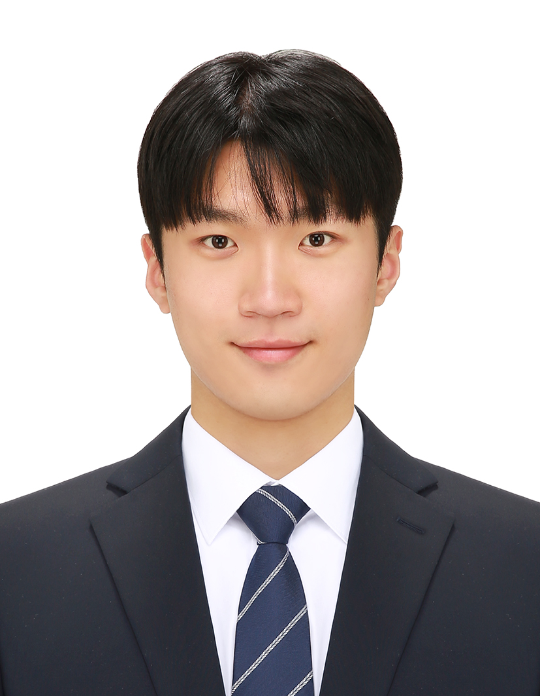

# 이현서 (Lee Hyeonseo)

실행이 곧 나를 만든다. 시행착오 속에서 배우며 성장 흐름을 만듭니다.

**인하대학교 컴퓨터공학과 (GPA 4.02 / 4.5)** | 임베디드 · 시스템 · 데이터 분석

📧 hynsxo@gmail.com

---
 
## About Me
 
드럼 연주 로봇의 팔이 미세하게 어긋나는 이유를 추적하다, 결국 통신 프로토콜 문서를 처음부터 다시 읽어야 했습니다. 그 과정에서 필요했던 물리학과 전공 수업까지 들었고, 우수한 성적으로 마쳤습니다.
 
돌아보면 제가 겪은 프로젝트들은 결국 같은 질문으로 이어져 있었습니다. **이 데이터는 지금 어디서 와서, 어디로, 얼마나 정확하게 흘러가고 있는가.** 로봇의 CAN 통신이든, UAM 항로의 소음 데이터든, 은행의 해외송금 파이프라인이든, 차량 간 V2V 통신이든 — 분야만 다를 뿐 확인하는 방식은 늘 같았습니다.
 
익숙한 전공 지식만으로 안 풀리면 물리학 수업이든 프로토콜 스펙 문서든 가리지 않고 파고듭니다. 아래 프로젝트들은 그 과정에서 제가 어떤 선택을 했고, 무엇을 배웠는지에 대한 기록입니다.

---
 
## 주요 프로젝트 & 경험
 
### 🔬 학부연구생 — CVIP 컴퓨터비전 연구실
*2024-1학기 | OpenCV, YOLOv5*
 
기존 냉방 시스템은 사람이 있든 없든 같은 온도를 유지해 전력을 낭비한다는 점에 착안해, **실시간 인원 인식 기반 자동 온도 제어 시스템**을 설계했습니다.
 
- 스탠퍼드 CS231n 커리큘럼으로 신호처리와 이미지 분류·검출 이론을 독학
- YOLOv5 기반 실시간 사람 수 인식 모델을 구현하고, 에어컨 API와 연동해 인원 수에 따라 온도가 자동으로 바뀌는 구조를 완성
전공 수업(CS231n)에서 배운 이론을 처음으로 손에 잡히는 시스템으로 옮겨본 경험이었습니다.
 
### 📊 국토·교통 데이터 활용 경진대회 — 한국공항공사 사장상 (우수상)
*2024.04 ~ 2024.08 | Python, OpenCV*
 
UAM(도심항공교통)이 상용화되려면 성능만큼이나 **주민들이 실제로 받아들일 수 있는 소음 수준**이 관건이라 판단해, 데이터 기반 소음 절감 항로 모델을 제안했습니다.
 
- 천만 건 규모의 교통 데이터를 분석해 지역별 인구 밀도, 시간대, 소음 민감도를 수치화
- OpenCV로 지도 이미지를 처리해 지역별 소음 민감도 가중치를 산출, 항로 설계 알고리즘에 반영
- 소음 민감 지역을 우회하면서도 비행 효율을 크게 해치지 않는 항로 설계 로직을 완성해 UAM 항로 모델의 표준안으로 제시
단순 최단 경로가 아니라 "누가 소음 피해를 보는가"를 변수로 넣은 게 이 프로젝트의 차별점이었고, 이 접근으로 한국공항공사 사장상을 수상했습니다.
 
### 🤖 한국과학기술연구원(KIST) 인공지능연구단 학부 현장실습 (10자유도 양팔 드럼 연주 로봇)
*2024.12 ~ 2025.02 | C/C++, CAN(CANopen) 통신, GDB*
 
로봇 팔의 움직임이 부자연스러운 원인을 끝까지 추적한 결과, 진짜 문제는 하드웨어가 아니라 **제어 모드 전환 시의 통신 지연**이었습니다. 이 구조를 SDO 통신 기반으로 재설계해 개발 기간을 약 2개월 단축시켰습니다.
 
- 포지션↔토크 제어 모드 전환 시마다 모터 위치값 동기화가 늦어지는 것을 확인, 기존 PDO 방식만으로는 실시간성이 부족하다고 판단
- SDO 통신으로 모터 실시간 위치값을 직접 수집하는 하이브리드 통신 구조를 제안·구현
- 로봇 허리 움직임을 최소화하는 궤적 생성 알고리즘(다익스트라 + 보간법) 개발, 모터 PID 튜닝, GDB로 시스템 취약점 디버깅
- GitHub 컨벤션 기반 버전 관리 체계를 구축해 협업 환경 조성
자연스러운 드럼 타격 동작을 구현했고, 전체 코드 흐름을 연주 상태 기반 다이어그램으로 정리해 이후 합류하는 사람도 바로 이해할 수 있도록 남겼습니다. 통신 프로토콜 문서를 처음부터 다시 읽어야 했던 것도 이 프로젝트였습니다 — 익숙한 방식이 안 통하면 기초로 돌아간다는 걸 배운 경험입니다.
 
### 🏦 IBK기업은행 IT금융개발부 청년인턴 (33기 우수 인턴 선정)
*2025.07 ~ 2025.08 | 금융 시스템 아키텍처 분석, 서비스 설계*
 
해외송금 시 수취계좌를 잘못 입력하면 전신료가 낭비되고 사후 처리에 인력이 소모된다는 구조적 문제를 발견하고, **사전 검증 서비스**를 제안했습니다 — 실제 개발 안건으로 채택되었습니다.
 
- 대규모 은행 계정계 시스템의 데이터 파이프라인을 분석해 아키텍처 데이터흐름을 도식화
- SWIFT Pre-validation, 내부 송금 이력 데이터, 룰 기반 필터링을 결합한 3중 검증 프로세스(Data-driven · API · Rule-based) 설계
- 아이디어 제안에 그치지 않고 실제 시스템 구조에 맞는 구현 가능성까지 검토해 제안서 작성
인턴이 낸 제안이 실제 개발 안건으로 이어지는 경우는 흔치 않습니다. 이 제안은 IBK기업은행 33기 우수 인턴 선정으로 이어졌습니다.
 
### 🚗 KAIST 모빌리티 챌린지 본선진출상 (팀 카스피)
*2025.10 ~ 2026.02 | V2V·V2I 협력 자율주행, LiDAR*
 
여러 대의 차량이 각자 알아서 판단하는 대신, 차량 간 통신으로 미리 조율하는 협력 주행 구조를 구현했습니다. 그중 제가 맡은 부분은 **사거리 교차로에서 어떤 차량이 먼저 지나갈지를 결정하는 우선순위 판단 알고리즘**이었습니다.
 
- 라이다 센서를 활용한 소형 차량의 협력 자율주행 기술 구현에 참여
- 사거리 교차로 상황에서 차량 간 위치·속도 데이터를 기준으로 통행 우선순위를 결정하는 알고리즘을 직접 설계
- 다수 차량이 동시에 진입하는 상황에서도 충돌 없이 교차로를 통과하도록 로직 검증
KAIST 모빌리티 연구소장 본선진출상을 수상했습니다.
 
### 🌏 인하대 국제학부 SGCS 근로장학생 (3년)
*2024.03 ~ 2026.06 | 외국인 학생 응대 · 행사 기획*
 
한국어가 서툰 유학생에게는 사소한 행정 실수 하나가 비자 문제로 번질 수 있습니다. 매번 "이 학생 입장에서 지금 가장 급한 게 뭘까"부터 확인하는 걸 원칙으로 삼았습니다.
 
- 3년간 비자 연장, 주거 문제 등 한국 생활 행정을 영어로 안내·상담
- 약속한 처리 기한은 반드시 지키는 방식으로 신뢰를 쌓아, 담당 교직원으로부터 "어디서든 환영받을 사람"이라는 평가를 받음
- 다양한 국적과 배경의 학생·교직원과 협업하며 글로벌 커뮤니케이션 역량을 키움
이 경험은 이후 IBK 인턴에서 "이 서비스를 받는 사람 입장에서 무엇이 문제인가"를 먼저 보는 습관으로 이어졌습니다.
 
---
 
## Skills
 
- **Languages**: C/C++, Python, Java
- **분야**: 임베디드 시스템, CAN(CANopen) 통신, 컴퓨터비전, 데이터 분석, 금융 시스템 분석
- **Frameworks & Libraries**: OpenCV, ROS2, CUDA, OpenMP, FastAPI
- **Tools & Environment**: Linux (Ubuntu), GDB, CMake, Git/GitHub
- **수학·물리 기반**: 컴퓨터기반선형대수, 현대물리학, 수리물리학 수강
## Education
 
- 인하대학교 컴퓨터공학과 — **GPA 4.02 / 4.5**
- 우수 이수 과목: 오퍼레이팅시스템(A+), 컴퓨터네트워크(A+), 컴퓨터구조론(A+), 시스템프로그래밍(A+), 인공지능(A+), 현대물리학(A+), 컴퓨터기반선형대수(A+), 자바기반응용프로그래밍(A+), 리눅스 프로그래밍(A), 수리물리학(A) — 우수한 성적으로 이수
## 자격 / 어학
- 정보처리기사 (2026.09.11 합격자 발표 예정)
- 운전면허 1종 보통·대형, 2종 소형
- 한국사능력검정시험 1급
- TOPCIT Practitioner (Lv.3, 501점)
## Awards & Scholarships
- 해성문화재단 전액장학금 (2024-1)
- 인하대 정석 북튜버 영상후기 공모전 장려상 (2025)
- 한국공항공사 사장상 (국토·교통 데이터 활용 경진대회, 2024)
- 인하대 컴퓨터공학과 성적우수 장학금 (2025-1)
- 울산연구원 우수장학금 (2025-1, 2025-2, 2026-1)
- KAIST 모빌리티 연구소 챌린지 본선진출상 (2026)
- 인하대 소프트웨어융합대학 성적우수상 (2026)
## Activities
- 대한민국 육군 병장 만기전역 (2022.01 ~ 2023.07)
- 인하대 국제학부 SGCS 근로장학생 (2024.03 ~ 2026.06) — 외국인 학생 비자·주거 상담 및 교내 행사 기획
 
